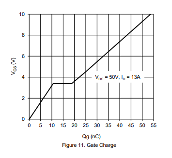

# Guide to MOSFETs
MOSFETs are by far the most popular component for switching DC power under the control of a microcontroller or any low power DC source. Despite this, there is a great deal of misinformation, misunderstanding, and poor advice in Hobby and Arduino circles. The questions I routinely receive from customers has made clear that a great many people are using these parts without a full understanding of what they are, how they work, how to select them, or whether they can do what is asked of them. What is presented here is by no means intended to be an exhausive explanation; rather, it is simply a primer from a very practical perspective on selection of these parts for common microcontroller projects. This document describes N-channel and P-channel enhancement mode MOSFETs for the purpose of switching. "depletion mode" MOSFETs and advanced uses of MOSFETs are beyond the scope of this guide.

## What a MOSFET is for
Simply put, a MOSFET allows a low voltage, low current signal to trun on and off a higher voltage and/or higher current load. An example of such a load might be a collection of LED lights in a room, pumps for outdoor applications, or a motor on a scooter. MOSFETs are only suitable for switching DC power, and similarly require a DC (including PWM) signal which **shares a common reference** with the MOSFET (typically ground). 

## The very basics
A MOSFET is controlled by the voltage difference between the Gate and the Source, Vgs. Enhancement mode MOSFETs (by far the most common) are "off" when this is 0V, applying a voltage to the gate will allow current to flow from the source to the drain - however, regardless of being on or off, there is an intrinsic diode between the drain and source - put another way, MOSFETs only block current in one direction (though while "off" this diode has a typical diode drop, while when "on", it will have the low resistance of the MOSFET in it's on state).  All MOSFETs will have an Rds(on) specified for at least one Vgs, and usually multiple. This is the on-state resistance (the resistance when the MOSFET is "on"); for modern power MOSFETs, this is usually on the order of milliohms. The lowest Vgs for which an Rds(on) is specified is the lowest drive voltage that should be used with that MOSFET. Below that, though the MOSFET may conduct, it will only be "partially on", with a much higher Rds; used in this way, it drop more voltage, and accordingly create more heat (sometimes much more!) than it would when used with an appropriate gate voltage. 

### N-channel, P-channel
There are two basic types of MOSFETs - P-channel and N-channel. N-channel MOSFETs are most common - any given level of performance, the N-channel MOSFETs will always be cheaper than a comparable P-channel one (for manufacturing reasons, N-channel devices are easier to make) - fortunately, they are also the type that is easier to control, as can be seen below. 

#### N-channel MOSFETs
N-channel MOSFETs switch the "low side" of a load. They are typically used with Source tied to ground, and Drain tied to the low side of the load. When a positive voltage is applied to the gate relative to the source, the MOSFET is turned on. Because the gate voltage need only be a few volts higher than the source, it is easy to control these parts with the output of a typical microcontroller, which would output between 3.3v and 5v as a "HIGH".

Because N-channel MOSFETs typically have markedly higher performance, schemes have been devised to use them even to drive the "high side" - these schemes generally require that the MOSFET be continually switched to function; the usual scheme is to use the regular swings of the voltage on the drain to charge a capacitor which provides the higher voltage to switch it. While use of such devices is beyond the scope of this guide, the important takeaway is that a MOSFET driver which uses such a "bootstrap" capacitor cannot be used if you are not continually switching the FET. This fact is sometimes glossed over in the datasheets for MOSFET drivers.

#### P-channel MOSFETs
P-channel MOSFETs switch the "high side" of a load. They are typically used with Source tied to the positive supply rail, and Drain tied to the high side of the load. When a voltage lower than the source (supply voltage) is applied to the gate, the MOSFET is turned on. This makes their control with a microcontroller somewhat awkward if the MOSFET is to switch a higher voltage than the microcontroller's operating voltage - to turn it off, the gate voltage must be equal to the source voltage. This is normally done using a small N-channel MOSFET to switch the gate itself - however in this case, care must be taken that the maximum Vgs rating is not exceeded.

## Vgs and Rds(on)
As noted above, an Rds(on) is typically specified for at least two values of Vgs, sometimes three. Additionally a Vgs(th) and a maximum Vgs are specified. The Vgs voltages for which an Rds(on) is provided usually correspond to a fraction of a volt below common "logic level" voltages, to compensate for a variety of factors. 2.5V or 2.8V is appropriate for 3.3V logic levels, 4.5V for 5V logic, 1.8V for 2.5V logic, and 10V for "standard voltage" (12V logic, from way back in the day). Rds(on) is often specified as both a "typical" and "maximum". Always use the maximum in your calculations. To turn on a MOSFET, you should apply a voltage higher than the lowest Vgs for which an Rds(on) is specified; you must never apply a voltage higher than the maximum Vgs, as that could damage the part. 

The typical performance curve for a MOSFET has decreasing Rds(on) as Vgs is increased - but beyond a certain point, there is no further improvement to be had. Voltages between the highest Vgs for which Rds(on) is specified and the maximum Vgs will offer little further reduction in on-state resistance. 

There is also a general correspondence between Vgs(on) and Vds - MOSFETs capable of switching higher voltages typically require a higher gate voltage to do so. While power MOSFETs that can switch 100V at 10A under real conditions with 5V logic levels are nothing special, there are few high current options available to switch even 30V with 3.3v logic levels. The solution in that case is what is known as a Gate Driver (see that section, below)

### Standard (10V) voltage MOSFETs and 5v logic
It is surprisingly common to see standard voltage MOSFETs such as the IRF540 (where Rds(on) is not specified below Vgs=10V) marketed towards Arduino users. They are not suitable for this application. They get away with this for a few reasons; First off, the MOSFETs are close enough to "on" with 5v on the gate that they will work for non-demanding use cases - and most Arduino use cases aren't very demanding. Second, most Arduino users are not sufficiently familiar with MOSFETs to recognize that the seller was marketing the product dishonestly even when they do have problems - they just know that their FETs keep overheating. Finally, the sellers are insulated from disatisfied customers since most are located overseas. The prevalence of these boards - and the fact that you can just *forget* about trying to use one on a 3.3V microcontroller - was the impetus for creating our 4-channel MOSFET boards.

## "floating" gates
A MOSFET does not include any mechanism to ensure that the voltage on the gate, in the absence of input, is equal to the source (ie, Vgs=0 and MOSFET off). If you do not provide such a mechanism, then - like a "floating" input to a microcontroller - the gate will pick up ambient electrical noise and the FET will turn on and off randomly. The simple solution to this is to include a small resistor between the gate and source, termed a "pull-down" resistor (or "pull-up" resistor for P-channel MOSFETs). *All MOSFET breakout boards sold by Azduino include a 10k resistor between source and drain for this purpose*.

## Gate "series" resistors
As noted above, MOSFET gates act as a capacitor. Because of this, there is a level of concern about the potential for damage to microcontroller pins from these current spikes; It is commonplace to install a small resistor between the microcontroller I/O pin and the gate of the MOSFET a MOSFET directly. While the risk of damage is frequently overstated on many electronics forums, a small resistor is still good practice when using a microcontroller I/O pin to directly drive the gate; this also helps to reduce EMI. On all of our 4-channel MOSFET boards except those with a MOSFET driver, we include a 100 Ohm series resistor between the inputs and the MOSFET gates; this value, combined with the output impedance of the I/O pins on popular microcontrollers, is sufficient to limit the maximum current to just about 40mA - ensuring that the specs of an AVR, STM32, or ESP32 microcontroller are respected (in the case of the ESP8266, this is never a concern - it's pin drivers are quite weak compared to other families of microcontroller), with minimum impact on the switching speed. On the SOT-23 MOSFET breakouts, we do not include such a resistor, though you are free to place one between the MOSFET gate and the pin driving it; because these are smaller MOSFETs, with a lower gate charge, this is less of a concern. 

## Inductive loads require a diode
Whenever an inductive load is being switched, a diode is required. An inductive load is a motor, a solonoid, a relay, or - in a DC-DC converter - an inductor (it's no coincidence that these all involve coils of wire and magnetic fields). When a load like this is turned off, the inductor tries to keep the current flowing, even though it now has nowhere to go. Unchecked, this would result in a large spike in the voltage at the drain of the (now turned-off) MOSFET; this spike can be many times the applied voltage (this is the principle of a "boost converter", as well as a "spark coil"), will exceed the maximum Vds rating of the MOSFET, and promptly destroy it. To prevent this (assuming an N-channel MOSFET switching the low side of a load), a diode should be placed between the low side of the inductive load and the positive supply, so that as soon as the voltage on the low side rises above the supply voltage, the "flyback" or "back EMF" flows through the diode, to the positive supply, and back through the inductive load until it dissipates. For best results - least chance of damage to the MOSFET, least radiated EMI, and least noise on the positive supply rail - this diode should be placed as close to the load as possible; *ideally, it should be placed between the terminals of the load itself*. Immediately after the MOSFET is turned off, the current through the diode will be approximately equal to the current that was going through the load - so the diode must be sized to handle that load. If the diode fails to an open circuit, the MOSFET will quickly follow; an undersized diode will often survive for a short time before failing; 

# MOSFET SIZING AND SELECTION GUIDE
The following should serve as a rough guide to selecting an appropriate MOSFET for your application - without having to do a full-on simulation of the 

## Maximum Current
Determining whether a MOSFET can handle your load when you are not PWMing is quite simple. Find the Rds(on) for the Vgs you will be using from the datasheet. Calculate the power dissipation from P=I2R - current in Amps and resistance in Ohms gives power in watts. From the datasheet, find the thermal resistance (junction to ambient), RƟJA, multiply them together, and you get the difference in temperature between the ambient air and the "junction" (the piece of silicon doing the switching); be sure to check the footnotes - they will specify the size of the copper pad it is soldered to, and most real designs don't meet that specification because board area costs money and people want a smaller device. Unless the datasheet also specifies the thermal resistance for a minimal footprint, a first order approximation would be to add 50% to the number they give (this number is based on the rare few datasheets that specify both with a nice, big pad, and the minimal one). Add that to the highest ambient temperature that you expect your project to cope with, and that should be lower than the maximum junction temperature specified on the datasheet. You want it to be a lot lower, because you should never try to push a MOSFET to the limits of it's specs. Adding heatsinks to the FETs - as we offer - will help some, by reducing the junction-to-ambient thermal resistance, though it is difficult to quantify the size of this benefit.

### When RƟJA is not specified
Occasionally, rather than specify a layout dependent junction-to-ambient thermal resistance, the manufacturer will only specify a "junction to case" thermal resistance; this is not particularly helpful. One example that is relevant to our products is the MCU90N02 by MicroCommercial Components - it is, without question, a great part, but the datasheet is shorter and less thorough than most (this is not particularly surprising considering their prices and performance). In cases like these, barring rigorous testing, it is reasonable too assume similar thermal resistance as parts in the same package from other manufacturers, as there is no particular reason to suspect that their parts would have drastically different behavior than those of another manufacturer in the same pacakge. 

### "Maximum Continuous Drain Current" and Tc
Often, the datasheet will specify a "maximum continuous drain current" - when this is specified for "Ta" (ambient temperature) it can basically be taken at face value (considering above warning about not using a MOSFET right at its limits), this saves you the math described above (assuming you are using it at Ta=25C). On MOSFETs which do not have a thermal pad, this is usually all that is specified.

However, many datasheets (particularly for larger MOSFETs, with a thermal pad for heatsinking) only specify the maximum continuous drain current only for select values of Tc (case temperature); this is almost universally the "headline" specification for MOSFETs. This specification is not very useful (nor is anything specified at "Tc"). Those values apply to the case where the "case temperature" (that is, the temperature of the outside of the package) is held constant at the temperature specified *regardless of how much heat it is generating*; this is the point when, despite a magic, ideal heatsink that keeps the outside of the package at room temperature, it is still dissipating so much heat that die would overheat and fail. Put another way, it is the theoretical upper bound on current - and it generates a nice big number for the manufacturer that marketing can put front and center. While it is not a realistic representation of maximum current capacity, its ubiquity makes it useful as a starting point for comparing the relative current handling of several prospective MOSFETs. 

## PWM 
In the following discussion, it is assumed that we are working with an N-channel MOSFET, as that is a far more common use case, but the same principles apply to P-channel FETs as well

PWM makes MOSFET sizing considerably more complicated. The main reason being that the voltage on the gate does not switch instantly; there is a "gate charge" that must be supplied or removed to change Vgs, making it essentially like a capacitor. The beefier the MOSFET - higher current, lower Rds(on), and so on - the larger the gate charge required to turn it on and off. During that time that the MOSFET is between "off" and "on" it will conduct - but its Rds will be much higher than when it is fully on - accordingly, more heat will be generated within the MOSFET. Potentially many times more; the wasted power during switching is called the "switching loss" - under some circumstances, it can dwarf the power dissipation during the on state. One hopes that it will spend only a small fraction of it's time in that state - depending on how often it is switching (Fsw), and how quickly it is switched (a function of gate current Ig, itself dependent on Rg, the resistance between driver and gate). Intuitively, we know that at a low enough frequency, with fast enough switching, this is nothing to worry about (surely one could switch it at, say, 1 Hz without fear, even with a very weak gate drive) - and we can imagine switching it so quickly that, as soon as it was turned on, we tried to turn it off again, and surely before that point, the heat from those switching losses would cook the unfortunate semiconductor. 

How do you figure out whether the PWM frequency that you want is "too high"? 

### TLDR
If you're using Arduino analogWrite or similar, which gives you 500 Hz (8 MHz system clock) to 1.2 kHz (20 MHz system clock), you generally don't have to worry about this. Whether by design or coincidence, pretty much anything above that (certainly if you hope to run at 20 kHz to eliminate audible buzzing when controlling motors - or even a few kHz), however, you will need to use MOSFET drivers to get faster PWM. The exception to this is our boards based on the smaller AOD476; those boards can be used up to around 8 kHz. 

### In more detail

Every MOSFET datasheet has a graph like this:

**In Words** As charge flows into the gate (through the source impedance and series resistors), the gate voltage initially rises like the voltage on a capacitor - this is the gate-to-source charge Qgs (sometimes conveniently given as capacitance, Cgs). Then, current begins to flow from drain to source; as charge continues flowing into the gate, the voltage stops increasing - this is is due to gate-to-drain ("Miller") charge - as Vds drops, the incoming charge must overcome the capacitance between the gate and the (rapidly falling) drain voltage. Once the drain voltage is close to the source voltage, Vgs once more rises linearly with the charge on the gate. Note that while the graphs like this found in datasheets are a simplification (the transitions are not instantaneous in reality), that basic shape can be seen on an oscilloscope. These three phases are also amenable to (relatively) straightforward modeling: the first and third regimes can be approximated as an RC-circuit, while within the second one, the "miller plateau", the current in is constant, can be calculated from Ohm's law and Qgd, and the key parameter is it's duration. 

It is this second regime that is that is most important when considering switching losses; this is when Vds falls from the full off-state voltage to just above zero, and Id rises from nearly nothing all the way to the almost the full load current. Recall that power dissipation is the product of Vds and Id (`P = V x I`); before the miller plateau, Id is nearly zero, while after it, Vds is nearly zero - but within it, when both are far from zero, Pd is at a maximum. 

The attached spreadsheet provides these calculations for all of the MOSFETs used in our current-production 4-channel MOSFET boards. A very pessimistic assumption is made for the relationship between Id and Vds - we assume that Id immediately reaches a maximum when we reach the miller plateau. On the other hand, there is some amount of additional swiching loss due to the time in the third regime (when the full current is flowing, but Rds has not reached it's final value), and in the first regime, between Vgs(th) when current begins to flow, and the start of the plateau. It includes calculations for both the rising and falling edges - because the plateau is not halfway between the controller voltage and ground, the two edges are not symetric. 

[MOSFET switching time](https://docs.google.com/spreadsheets/d/1JyChO1zQWo-ZLIhfKLuutq3La7ZKkVMKA6Yu1RRqcoM)

It also calculates the portion of time (as percentage of a PWM cycle at a specified frequency, and in nanoseconds) the time to turn on and turn off, overall switching time, time spent on the plateau, and more. Knowing the time for switching in terms of the PWM cycle becomes important when writing code that will controlling MOSFETs - as implied above, when you start to push the PWM frequency even a little, the minimum PWM duty cycle is on the same scale as the time it takes for the FET to turn on (usually this limit is encountered on the turn-off first, because of the gate charge that must be removed to reach the miller plateau), and you need to take account of this if you need to generate particularly low duty cycles. While this spreadsheet is not meant to be the be-all and end-all of MOSFET sizing, it provides a crude estimate of the increase in power disipation due to switching losses and a reasonable estimate of a wide variety of parameters.

Regardless of the application, a key takeaway from this is that, if using PWM, you should be certain to leave extra "headroom" when you choose your MOSFETs. If you need serious high-frequency performance, there is really no substitute for using a gate driver. 

# MOSFET Gate Drivers
A MOSFET "gate driver" does exactly what it sounds like it does - it is a specialized IC designed specifically for driving the gate of a MOSFET, capable of delivering a very brief pulse of current on the scale of **amps** to the gate of a MOSFET. This turns the MOSFET on or off almost instantly. PWM frequencies in the tens of kHz and beyond are within reach! In addition to that, they act as a "level shifter" - the NCP81071B we use on our [high performance MOSFETs with optional drivers](https://www.tindie.com/products/6503/) can apply up to 20V to the gate of a MOSFET, in a pulse with peak current of 5 amps, in response to a 2.5V logic level signal. With a MOSFET driver in use, you no longer need to worry about switching losses until the switching frequency gets *way* up there - the NCP81071 datasheet provides specifications for switching frequencies as high as 2 MHz!

A gate driver is only of benefit when the 

# MOSFETs versus BJTs (ex, TIP-series, Darlington, NPN/PNP, etc)
MOSFETs are used for many of the same things that BJT's (bipolar junction transistors) were used for in the past; for power switching applications, MOSFET technology left BJTs in the dust decades ago. While there are still appropriate uses for BJTs in these times, load switching is not one of them. The voltage drop across a BJT is given by Vce(sat) - for a darlington, this could be 2V or more! For a modern MOSFET, however, this is often less than a tenth of a volt. MOSFETs are much better switches - don't use a BJT as a switch in 2020.

Consider the TIP-120 (still recommended by some guides for use with an Arduino), being used to switch a 2A load, powered from a 12V supply. Vce(sat) will be around 2V, so the TIP-120 will be dissipating `2V x 2A = 4W` - it will need a heatsink. 1/6th of the power supplying the load is being wasted in the transistor as heat. That could be replaced with a rice-grain sized AOD3416 MOSFET (like the ones we sell pre-mounted on little breakout boards here: ) - with 5V on the gate, it would have a Rds(on) of 0.022 Ohms; at 2A the voltage drop will be only 0.044V - 44 mV! 	`0.044V x 2A = 0.088 W` - less than 1/10th of a watt will be disipated as heat in the MOSFET! Instead of 16.7%, less than 1% of the power will be wasted in the transistor. No, there isn't a math error in there, MOSFETs really are that much better. 

So why do guides, tutorials, and similar resources which suggest using such obsolete parts still exist? Largely, I think that it's a matter of inertia - tutorials were written, people learned to use those parts, and until they find themselves having to switch a load that is impractical to handle with a BJT, Arduino users likely do not realize what they are missing. A significant number of Arduino users are older and retired. Having learned electronics back in the days of BJTs. Back then, early MOSFETs were expensive, prone to damage from static (a problem also long-since solved), and difficult to drive directly ("standard voltage", ie, Vgs 10V to turn on). This persistence of obsolete BJTs within hobby circles is also likely part of the reason that MOSFET boards based on the IRF540 - which is ill suited to use with 5V logic levels as discussed above - are still successful in the market: They still outperform BJTs!

## Differences between BJTs and MOSFETs
Phenomenologically, an NPN transistor and an N-channel MOSFET have a great deal of similarity - in the simplest configuration, one would connect the emitter to ground, the collector to the negative side of the load, and, when a current, supplied from a pin driven higher than the emitter, is supplied to the base, it will conduct - like an N-channel MOSFET with source to ground, drain to negative side of load, and a positive voltage on its gate. Also like a MOSFET, between the collector and emitter in the opposite direction, it will act like a diode. The same goes for P-channel and PNP transistors. Like N-channel MOSFETs, NPN transitors have better performance and/or lower prices than their PNP complements.

The big difference between them is that where a MOSFET is controlled by the *voltage* applied to the gate, a BJT is controlled by the *current* supplied to the base; the current that flows when the BJT is on is increased (to a point) by the current flowing through the base (the beta or gain of the transistor). The minimum voltage drop across a MOSFET is much lower; when fully on, a MOSFET appears like a resistor (often with a very low resistance), with a voltage drop that goes to zero at low current whereas a BJT has a minimum voltage drop, Vce(sat) - which is what is responsible for their miserable performance compared to MOSFETs when acting as a simple switch. Because they are controlled by current, they don't require the pull-down resistor that a MOSFET does on the gate to ensure that they stay off when not connected - if there's no source of current, a BJT is off. On the other hand, they do require a "base resistor" between the controller and the base to limit the current; the base essentially acts like a diode to the emitter - without something to limit the current,  a large current would flow, which would be destructive to both the BJT and/or whatever was trying to control it. 

## Converting BJT designs to MOSFETs
*This section will be added in a future version of this guide*

# Troubleshooting 
*this section will be expanded in a future version of this guide*

## Failure modes of a MOSFET
When a MOSFET (like any failed component) burns out, it could have a variety of behaviors, but one failure mode is by far the most common: it fails "stuck on" - the source and drain conduct in both directions, regardless of what voltage is applied to the gate. Usually not as well as it did before failure when "on" (so it will be heating up more than it normally would), but with a high enough conductivity that the load is on full time. When a MOSFET circuit initially works, but then becomes "stuck on", you should suspect a failure of the MOSFET; in turn, this is likely caused by either overheating (from either excessive current, or switching losses), or if the load is inductive, failing to effectively clamp the back EMF. 

A brief anecdote: One of my first experiences with MOSFETs involved patching up a pair of scooters we'd snagged (less control circuitry) from the local dump; having wired up a MOSFET to control the motor (but having used an woefully insufficient flyback diode), I tested out the switch... the wheel spun! It worked! With no load on the motor, even the undersized diode was fine. So, of course, I did what any high-school-age kid would do, and hopped on. In our back yard, I pressed the switch, and the scooter lurched forward "Success!" - but now, having to propel both a person and a scooter, the motor was drawing far more current - of course, the back yard wasn't very big, so, noticing that I was fast approaching some bushes, I released the switch... but the scooter kept going, and I careened into the bushes. The motor kept spinning until we'd taken the housing off and could disconnect the batteries...
