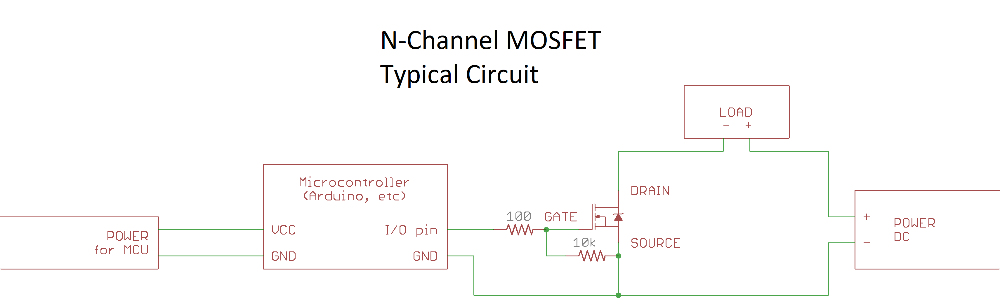

# Guide to MOSFETs
MOSFETs (Metal Oxide-Semiconductor Field Effect Transistors) are by far the most popular component for switching DC power under the control of a microcontroller or any low power DC source. Despite this, there is a great deal of misinformation, misunderstanding, and poor advice in Hobby and Arduino circles. The questions I routinely receive from customers have made clear that a great many people are using these parts without a full understanding of what they are, how they work, how to select them, or whether they can do what is asked of them. What is presented here is by no means intended to be an exhausive explanation; rather, it is simply a primer from a very practical perspective on selection of these parts for common microcontroller projects. This document describes N-channel and P-channel enhancement mode MOSFETs for the purpose of switching. "Depletion mode" MOSFETs and advanced uses of MOSFETs are beyond the scope of this guide.

## What a MOSFET is for
Simply put, a MOSFET allows a low-voltage, low-current signal to turn on and off a higher-voltage and/or higher-current load. An example of such a load might be a collection of LED lights in a room, pumps for outdoor applications, or a motor on a scooter. MOSFETs are only suitable for switching DC power, and similarly require a DC (including PWM) signal which **shares a common ground** with the MOSFET (other common references other than ground could be used; this is not commonly done for a variety of reasons). 

## The very basics
A MOSFET is controlled by the voltage difference between the Gate and the Source, Vgs. Enhancement mode MOSFETs (by far the most common) are "off" when this is 0V. Applying a voltage to the gate will allow current to flow from the source to the drain; however, regardless of being on or off, there is an intrinsic diode between the drain and source. Put another way, MOSFETs only block current in one direction (though while "off" this diode has a typical diode drop, while when "on", it will have the low resistance of the MOSFET in it's on state).  All MOSFETs will have an on-state resistance Rds(on) specified for at least one Vgs, and usually multiple. This is the on-state resistance (the resistance when the MOSFET is "on"); for modern power MOSFETs, this is usually on the order of milliohms. The lowest Vgs for which an Rds(on) is specified is the lowest drive voltage that should be used with that MOSFET. Below that, though the MOSFET may conduct, it will only be "partially on", with a much higher Rds; used in this way, it drops more voltage and accordingly creates more heat (sometimes much more!) than it would when used with an appropriate gate voltage. 

### N-channel, P-channel
There are two basic types of MOSFETs - P-channel and N-channel. N-channel MOSFETs are most common - any given level of performance, the N-channel MOSFETs will always be cheaper than a comparable P-channel one (for manufacturing reasons, N-channel devices are easier to make) - fortunately, they are also the type that is easier to control, as can be seen below. 

#### N-channel MOSFETs
N-channel MOSFETs are used to switch the "low side" of a load. They are typically used with Source tied to ground, and Drain tied to the low side of the load. When a positive voltage is applied to the gate relative to the source, the MOSFET is turned on. Because the gate voltage need only be a few volts higher than the source, it is easy to control these parts with the output of a typical microcontroller. Thus, when switching a load under the control of a microcontroller, you always want to switch the low side - unless there is some reason you can't.

#### P-channel MOSFETs
P-channel MOSFETs are used to switch the "high side" of a load. They are typically used with Source tied to the positive supply rail, and Drain tied to the high side of the load. When a voltage lower than the source (supply voltage) is applied to the gate, the MOSFET is turned on. This makes their control with a microcontroller somewhat awkward if the MOSFET is to switch a higher voltage than the microcontroller's operating voltage - to turn it off, the gate voltage must be equal to the source voltage. This is normally done using a small N-channel MOSFET to switch the gate itself. However, in this case, care must be taken that the maximum Vgs rating is not exceeded; the switching speed will also be far slower when the FETs are turned off, as only the gate pull-up resistor is acting to return the Vgs to 0. Of course, one can use a stronger pull-up, but then you need to make sure that the current through the pull-up while the FET is on does not dissipate an unreasonable amount of power... Many approaches are possible, depending on the required switching voltage, whether PWM (and hence fast switching) is needed, and so on. 

#### High side switching with N-channel FETs
Because N-channel MOSFETs have higher performance, schemes have been devised to use them to switch the "high side" as well - in this configuration, the positive supply is connected to the drain, and the load to source, generating the higher voltage required to turn on the FET through one method or another. With the maximum Vgs generally being much lower then the maximum Vds, part of these driver chips must be referenced to the source voltage, which is swinging wildly with respect to circuit ground during operation! Whatever specific implementation these parts use, it generally requires that the MOSFET be continually switched to function, as they count on the source voltage jumping up and down frequently to keep a capacitor charged to provide that higher voltage. This fact is often glossed over in the datasheets for those parts - that limitation is well-known and expected by their customers. Such devices are far outside the scope of this guide, and are mentioned here only because they show up when searching the catalogs of electronics parts suppliers when looking for parts to facilitate high side switching in simpler use cases; a high side driver that uses N-channel MOSFETs and/or mentions a "bootstrap" or "flying" capacitor will also require the MOSFET to be continually switched unless the datasheet specifically states otherwise.

#### Body Diodes, and current directionality
So as covered above, when "on", the MOSFET will allow current to flow from the drain to source (N-channel) or source to drain (P-channel), and when "off" they cannot conduct in that direction. **What about the other direction?** While on, the channel will conduct in either direction giving minimal voltage drop. The trap comes in the OFF state: Inherrent to the fabrication process of a MOSFET is a "Body diode" When the MOSFET is off, in the reverse direction, a MOSFET will act like a diode, that is, it will conduct with a voltage drop of around 0.7V. This occasionally matters. What do you do when you need to switch a connection between two points where you know only that they share a common ground (If they don't, you need a solid state relay, not a MOSFET)?

If you ponder this for a bit, you will likely recognize that there is a way to get a switch that blocks in BOTH directions when off, requires no additional pins to control, and has ohmic behavior while on in both direction (ie, no diode drop in either direction). You use two MOSFETs back-to-back: Connect the source of the two FETs together - now (example assuming N-channel fets, and you're connecting ground to something else when you turn on the fet). When off, the body diode will lead to the common source being at most 0.7v or so away from ground (or the other side, if it's at a lower potential. The gates should also be connected together assuming you want a simple switch. When the gate voltage is ground, it will be no higher, and possibly slightly lower than source. The FETs will both be off. Either would admit current in one direction through the body diode but not the other - so one or the other will prevent current flow. As soon as you turn on the FETs, source drops to ground (which makes the FETs even-more-on, amd since they conduct in both directions, your switch is now on and current flows either way, just like it would in a single MOSFET configuration - except admittedly with twice the on-state resistance, since there are two FETs to go through. 

While we used an N-channel pair in that example, this may be even more useful with P-channel FETs. Imagine you have a device that you want to switch between running at two voltages, say 5v and 3.3v.. Using a single P-channel FET for each, with source to power rail, drain to Vcc, when you enabled the 5V power connection, the other fet, for the 3.3v power, would have 5V (Vcc thanks to the first FET) on it's drain, and only 3.3v on it's source. Power would flow backwards and the voltage on the 3.3v rail would rise to 4.3V or so. The consequences range from unnoticable (if nothing is on that rail other than a regulator or buck converter, you may not even notice. If there are parts that tolerate max 3.3 or 3.6v on the 3.3v rail, it would be catastropic. 

The lesson of this is to 
* Remember there is a body diode.
  * It's easy to forget. As I write this, I have just thrown 140 brand new circuit boards into the junk PCB bin. Because (despite making some switches that did this correctly as part of the same PCB order) I forgot about the body diode on three designs). 
* Consider what voltage will be on the source, and on the drain of each MOSFET during all operational modes.
* If there will ever be a "reversed" Vds, you need back-to-back FETs to block the reversed flow (unless you analyze the circuit carefully and determine that this will not be problematic; this is a very rare case). 

## Typical connections
For the most common use case (at least among people who are likely reading this), using a microcontroller to switch power to a load using an N-channel MOSFET, a typical circuit will look like this:

In more concrete terms, using one of our [4-channel MOSFET boards](https://www.tindie.com/products/10230/) with a microcontroller to dim an LED strip and control a motor, the wiring might look something like this:

## Vgs and Rds(on)
As noted above, an Rds(on) is typically specified for at least two values of Vgs, sometimes three. Additionally a Vgs(th) and a maximum Vgs are specified. The Vgs voltages for which an Rds(on) is provided usually correspond to a fraction of a volt below common "logic level" voltages, to compensate for a variety of factors. 2.5V or 2.8V is appropriate for 3V or 3.3V logic levels, 4.5V for 5V logic and 1.8V for 2.0-2.5V logic. 10V is what is termed  "standard voltage" (12V logic, from way back in the day - now only used when a gate driver is being used to generate that voltage). Rds(on) is often specified as both a "typical" and "maximum". Always use the maximum in your calculations. To turn on a MOSFET, you should apply a voltage higher than the lowest Vgs for which an Rds(on) is specified; you must never apply a voltage higher than the maximum Vgs, as that could damage the part. 

The typical performance curve for a MOSFET has decreasing Rds(on) as Vgs is increased - but beyond a certain point, there is no further improvement to be had. Voltages between the highest Vgs for which Rds(on) is specified and the maximum Vgs will offer little further reduction in on-state resistance. 

There is also a general correspondence between Vgs(on) and Vds - MOSFETs capable of switching higher voltages typically require a higher gate voltage to do so. While power MOSFETs that can switch 100V at 10A under real conditions with 5V logic levels are nothing special, there are few high current options available to switch even 30V with 3.3V logic levels. The solution in that case is what is known as a Gate Driver (see that section, below).

### Standard (10V) voltage MOSFETs and 5V logic
It is surprisingly common to see standard voltage MOSFETs such as the IRF540 (where Rds(on) is not specified below Vgs=10V) marketed towards Arduino users. They are not suitable for this application. They get away with this for a few reasons; First off, the MOSFETs are close enough to "on" with 5V on the gate that they will work for non-demanding use cases - and most Arduino use cases aren't very demanding. Second, most Arduino users are not sufficiently familiar with MOSFETs to recognize that the seller was marketing the product dishonestly even when they do have problems - they just know that their FETs keep overheating. Finally, the sellers are insulated from dissatisfied customers since most are located overseas. The prevalence of these boards - and the fact that you can just *forget* about trying to use one on a 3.3V microcontroller - was the impetus for creating our 4-channel MOSFET boards.

## "Floating" gates
A MOSFET does not include any mechanism to ensure that the voltage on the gate, in the absence of input, is equal to the source (i.e., Vgs=0 and MOSFET off). If you do not provide such a mechanism, then - like a "floating" input to a microcontroller - the gate will pick up ambient electrical noise and the FET will turn on and off randomly. The simple solution to this is to include a small resistor between the gate and source, termed a "pull-down" resistor (or "pull-up" resistor for P-channel MOSFETs). 

*All MOSFET breakout boards sold by Azduino include a 10k resistor between source and drain for this purpose*.

## Gate "series" resistors
As noted above, MOSFET gates act as a capacitor. Because of this, there is a level of concern about the potential for damage to microcontroller pins from these current spikes. It is commonplace to install a small resistor between the microcontroller I/O pin and the gate of the MOSFET a MOSFET directly. While the risk of damage is frequently overstated on many electronics forums, a small resistor is still good practice when using a microcontroller I/O pin to directly drive the gate; this also helps to reduce electromagnetic interference (EMI) and can help prevent ringing and oscillation during switching (these more complicated effects will not be discussed in depth here).

On all of our 4-channel MOSFET boards except those with a MOSFET driver, we include a 100 Ohm series resistor between the inputs and the MOSFET gates; this value, combined with the output impedance of the I/O pins on popular microcontrollers, is sufficient to limit the maximum current to just about 40mA - ensuring that the specs of an AVR, STM32, or ESP32 microcontroller are respected (in the case of the ESP8266, this is never a concern - its pin drivers are quite weak compared to other families of microcontroller), with minimum impact on the switching speed. On the SOT-23 MOSFET breakouts, we do not include such a resistor, though you are free to place one between the MOSFET gate and the pin driving it; because these are smaller MOSFETs, with a lower gate charge, this is less of a concern. 

## Inductive loads require a diode
Whenever an inductive load is being switched, a diode is required. An inductive load is a motor, a solenoid, a relay, or - in a DC-DC converter - an inductor (it's no coincidence that these all involve coils of wire and magnetic fields). When a load like this is turned off, the current keeps flowing (the current through an inductive load by definition cannot change instantly) - even though it now has nowhere to go. Unchecked, this would result in a large spike in the voltage at the drain of the (now turned-off) MOSFET; this spike can be many times the applied voltage (this is the principle of a "boost converter" - used to convert a low DC voltage into a higher one, as well as a "spark coil", which generates thousands of volts for the spark plugs in a car from the car's 12V electrical system). This spike will exceed the maximum Vds rating of the MOSFET, and promptly destroy it. To prevent this a diode should be placed between the terminals of the inductive load such that it would only conduct when the voltage across the load is opposite the applied voltage (ie, band toward the more positive side), so that as soon as the voltage on the low side rises above the supply voltage (or in P-channel FETs and high side switching, the high side falls below ground), the "flyback" flows through the diode and back through the inductive load until it dissipates. For best results - least chance of damage to the MOSFET, least radiated EMI, and least noise on the positive supply rail - this diode should be placed as close to the load as possible; *ideally, it should be placed between the terminals of the load itself*. Immediately after the MOSFET is turned off, the current through the diode will be equal to the current that was going through the load - so the diode must be sized to handle that load. If the diode fails to an open circuit, the MOSFET will quickly follow; an undersized diode will often survive for a short time before failing. 

If you are using PWM with an inductive load (typically for speed control of a motor) there are additional considerations: You must ensure that the diode's "reverse recovery time" is fast compared to the PWM frequency - a "fast recovery" diode should be used, particularly if you are using a frequency higher than the 1-2kHz that can be achieved using a power MOSFET without a gate driver (see below). Motors are frequently PWM'ed at 20 kHz or more in order to eliminate the audible buzz from the motor at the PWM frequency (which forces use of a gate driver unless it is a very tiny motor, which could be driven with a correspondingly tiny MOSFET with smaller gate capacitance). At all but extremely (inappropriately) low PWM frequencies, the diode will still be conducting at the start of the next PWM cycle when the MOSFET is turned on again.

# MOSFET SIZING AND SELECTION GUIDE
The following should serve as a rough guide to selecting an appropriate MOSFET for your application - without having to do a full-on simulation. 

## Maximum Current
Determining whether a MOSFET can handle your load when you are not PWMing is quite simple. Find the Rds(on) for the Vgs you will be using from the datasheet. Calculate the power dissipation from P=I2R - current in Amps and resistance in Ohms gives power in watts. From the datasheet, find the thermal resistance (junction to ambient), RƟJA, multiply them together, and you get the difference in temperature between the ambient air and the "junction" (the piece of silicon doing the switching); be sure to check the footnotes - they will specify the size of the copper pad it is soldered to, and most real designs don't meet that specification because board area costs money and people want a smaller device. Unless the datasheet also specifies the thermal resistance for a minimal footprint, a first order approximation would be to add 50% to the number they give (this number is based on the rare few datasheets that specify for both a nice, big pad and the minimal one). Add that to the highest ambient temperature that you expect your project to cope with, and that should be lower than the maximum junction temperature specified on the datasheet. You want it to be a lot lower, because you should never try to push a MOSFET to the limits of it's specs. Adding heatsinks to the FETs - as we offer - will help some, by reducing the junction-to-ambient thermal resistance, though it is difficult to quantify the size of this benefit.

### When RƟJA is not specified
Occasionally, rather than specify a layout-dependent junction-to-ambient thermal resistance, the manufacturer will only specify a "junction to case" thermal resistance; this is not particularly helpful. One example that is relevant to our products is the MCU90N02 by MicroCommercial Components - it is, without question, a great part, but the datasheet is shorter and less thorough than most. (This is not particularly surprising. It is a Chinese company which appears to have licensed or developed a Trench-MOSFET technology on a par with the most capable western companies, yet are based in China, where employer demand for technical writers who are fluent english speakers vastly outstrips supply - and they're a relative newcomer; I suspect they're working towards the rigor we expect in western datasheets, they're just not all the way there yet; Compared to most Chinese datasheets, it's quite good.)

### "Maximum Continuous Drain Current" and Tc
Often, the datasheet will specify a "maximum continuous drain current". When this is specified for "Ta" (ambient temperature), it can basically be taken at face value (considering above warning about not using a MOSFET right at its limit, and the caveat about the board footprint); this saves you the math described above (assuming you are using it at Ta=25C). On MOSFETs which do not have a thermal pad, this is usually all that is specified.

However, many datasheets (particularly for larger MOSFETs, with a thermal pad for heatsinking) will instead spec the maximum continuous drain current at "Tc=25C". Invariably, these numbers make the product look REALLY good, and hence this is almost universally the "headline" specification for MOSFETs. It is also almsot entirely useless for sizing: Tc is "case temperature", that is, those values apply to the case where the "case temperature" (that is, the temperature of the outside of the package) is held constant at the temperature specified *regardless of how much heat it is generating*. (an unphysical assumption - you would need magic heatsinks that can dissipate arbitrary heat) - that the the internal thermal conductivity is no longer able to keep up with the heat generated by the overloaded die and the part will burn out, Put another way, it is the theoretical upper bound on current which is never seen in practice except for during the moments up to a catastrophic failure - and it generates a nice big number for the manufacturer that marketing can put front and center. While it is not a realistic representation of maximum current capacity, its ubiquity makes it useful as a starting point for comparing the *relative* current handling of several prospective MOSFETs. Just don't expect to get that kind of current to go through it and have a working FET afterwards.. 

## PWM 
*In the following discussion, it will be assumed that we are working with an N-channel MOSFET, as that is a far more common use case, but the same principles apply to P-channel FETs as well, as discussed elsewhere in this document and across the internet, they are the exact opposuite of an N-channel FET, but this usually makes them more awkward to use - and the underlying physics is less favorable, so they are also either more expensive or have poorer specs than N-channel ones. So you should of course try to stick to N-channel FETs when possible, but when impossible, remember that everything here applies to P-channel ones as well*

One great thing about MOSFETs is that, unlike relays or manual switches, they can use PWM to vary the brightness of a light, or the speed of a motor, or the output voltage of a DC-DC converter - because they switch fast, with essentially no limit to the number of times the fet can switch. However, if PWM is being used, particularly as the frequency is raised, MOSFET sizing becomes more complicated, because you can no longer limit your analysis to the steady state of the FET being either ON or OFF. You need to account for the time it spends *between those states*.

The main reason is that the voltage on the gate does not switch instantly; there is a "gate charge" that must be supplied or removed to change Vgs, making it essentially like a capacitor. Roughly speaking, the beefier the MOSFET - higher current, lower Rds(on), higher maximum Vds, and the older the manufacturing process used to make it, the larger the gate charge required to turn it on and off will be. During the time that the MOSFET is between "off" and "on", it's resistance is somewhere between Rds(on) and the near-infinite resistance of the off state. This is a very dangerous state to be in, because long before the internal resistance reaches the "fully on" state, it will be low enough for a large portion of the load current to be flowing through it during that brief period - accordingly, more heat will be generated within the MOSFET. Potentially many times more: the wasted power during switching is called the "switching loss" - and it is not unusual for the "switching loss" to contribute the majority of the heat dissipation, despite it (hopefully) spending only a tiny fraction of it's time in that state. 

But once you start PWMing non-trivial loads, you need to start asking yourself questions like "If I use this MOSFET, in this configuration, at that frequency, what portion of the time will the FET be fully on or off, and what percentage of the time will generating heat and wasting power during the switching process? Obviously the biggest variables here are the Qg and the Fsw. Similarly, the strength of the pin drive matters  Intuitively, pondering these facts you can probably see that even with a weak gate drive if your switching frequency is low enough, you'll be fine. And on the other extreme, you can imagine switching a FET so quickly that before it finishes turning on or off, we start trying to drive it in the opposite direction. This will result in it carrying a significant fraction of the current it's load would nominally draw, but at a much higher Rds than you designed for. 

How do you figure out whether the PWM frequency that you want is "too high"? 

### TLDR
If you're using Arduino analogWrite or similar, which gives you 500 Hz (8 MHz system clock) to 1.2 kHz (20 MHz system clock), you generally don't have to worry about this, whether by design or coincidence. Pretty much anything above that (certainly if you hope to run at 20 kHz to eliminate audible buzzing when controlling motors - or even a few kHz), you will need to use MOSFET drivers to get faster PWM from "power MOSFETs", those capable of handling current of amps to tens of amps. That includes all of our 4-channel boards except those based on the smaller AOD476; those boards can be used up to around 8 kHz, though they are also capable of handling far less current (we may add additional MOSFET options for this purpose in the future). 

The lower the current they can carry, the smaller the gate capacitance - so for small, lower current MOSFETs (like some of the SOT-23 MOSFETs we sell on convenient breakout boards), high frequency PWM is possible without a gate driver... but just because a MOSFET is in a SOT-23 package doesn't necessarily mean that it has a super low gate capacitance - some of those SOT23 FETs have specs are rated for >6-9A Id @ Ta=25c<\sub> with a small number of milliohms of resistance in the on state. Many (but not all) of these also have a surprisingly high gate capacitance
  
### Wiring
Starting from the above basic wiring diagram, if we instead used one of the Azduino 4-channel boards with drivers, it would look nearly the same, except that a 5-20V supply (5-10 recommended, must not be higher than MOSFET's Vgs(max)). In real designs, it is likely that at least one of the power sources would be derived from another; below, for example, we might use the 12v from the load power supply to power the gate driver, provided we were using FETs that were rated for >12 Vgs. 
  

### In more detail

Every MOSFET datasheet has a graph like this:

**In Words** As charge flows into the gate (through the impedance of whatever is driving it and any series resistors - Rg is often used for this), the gate voltage initially rises like the voltage on a capacitor - this is the gate-to-source charge Qgs (sometimes conveniently given as capacitance, Cgs). at the threshold Vgs(th), current begins to flow from drain to source. This causes the drain voltage to begin falling towards the source voltage. As this is happening, charge continues flowing into the gate - but the gate *voltage stops increasing* - this is is due to gate-to-drain ("Miller") charge, ie, parasitic capacitance between the gate and the draqin - as Vds drops, the incoming charge must overcome the capacitance between the gate and the (rapidly falling) drain voltage. Once the drain voltage is close to the source voltage and has no further to fall, Vgs once more rises linearly with the charge on the gate. . Note that while the graphs like this found in datasheets are a simplification (the transitions are not instantaneous in reality), that basic shape can be seen on an oscilloscope. These three phases are also amenable to (relatively) straightforward modeling: the first and third regimes can be approximated as an RC-circuit, while within the second one, the "Miller plateau", the current in is approximately constant and can be calculated from Ohm's law and Qgd, and from that, you calculate the critical parameter of how long the MOSFET will stay on the Miller plateau. 

This is important because it is that second regime that is that is most important when considering switching losses; this is when Vds falls from the full off-state voltage to just above zero, and Id rises from nearly nothing all the way to almost the full load current. Recall that power dissipation is the product of Vds and Id (`P = V x I`); before the Miller plateau, Id is nearly zero, while after it, Vds is nearly zero - but within it, \both are far from zero - so Pd is at a maximum. 

The attached spreadsheet provides these calculations for all of the MOSFETs used in our current-production 4-channel MOSFET boards, and can be modified to provide these calculations for other MOSFETs or system conditions: cells highlighted in pink are MOSFET specs, those in yellow specify the system conditions. A very pessimistic assumption is made for the relationship between Id and Vds, because skimping on the transistor, and then having it burn out is no fun. Better to play it safe on the transistor sizing, right? So we assume that Id immediately reaches a maximum when we reach the Miller plateau. On the other hand, there is some amount of additional switching loss due to the time in the third regime (when the full current is flowing, but Rds has not reached its final value), and in the first regime, between Vgs(th), when current begins to flow, and the start of the plateau. It includes calculations for both the rising and falling edges - because the plateau is not halfway between the controller voltage and ground, the two edges are not symmetric. 

[MOSFET switching time](https://docs.google.com/spreadsheets/d/1JyChO1zQWo-ZLIhfKLuutq3La7ZKkVMKA6Yu1RRqcoM)

It also calculates the portion of time (as percentage of a PWM cycle at a specified frequency, and in nanoseconds) to turn on and turn off, overall switching time, time spent on the plateau, and more. Knowing the time for switching in terms of the PWM cycle becomes important when writing code that will be controlling MOSFETs. As implied above, when you start to push the PWM frequency even a little beyond typical Arduino ~1 kHz speeds, unless you are using a gate driver, the *minimum PWM duty cycle is on the same scale as the time it takes for the FET to turn on (usually this limit is encountered on the turn off first, because of the gate charge that must be removed to reach the Miller plateau), and you need to take account of this if you need to generate particularly low duty cycles. While this spreadsheet is not meant to be the be-all and end-all of MOSFET sizing, it provides a crude estimate of the increase in power dissipation due to switching losses and a reasonable estimate of a wide variety of parameters.

Regardless of the application, a key takeaway from this is that, if using PWM, you should be certain to leave extra "headroom" when you choose your MOSFETs, and if the frequency is high, you may need a gate driver to make it work. And you can't get away from needing a gate driver just by getting beefier fets, because those will also have more 

# MOSFET Gate Drivers
A MOSFET "gate driver" does exactly what it sounds like it does - it is a specialized IC designed specifically for driving the gate of a MOSFET, capable of delivering a very brief pulse of current on the scale of **amps** to the gate of a MOSFET. This turns the MOSFET on or off almost instantly. PWM frequencies in the tens of kHz and beyond are within reach! In addition to that, they act as a "level shifter" - the NCP81071B we use on our [high performance MOSFETs with optional drivers](https://www.tindie.com/products/6503/) can apply up to 20V to the gate of a MOSFET, in a pulse with peak current of 5 amps, in response to a 2.5V logic level signal. With a MOSFET driver in use, you no longer need to worry about switching losses until the switching frequency gets *way* up there - the NCP81071 (there are pin compatible devices with similar specs from other manufacturers. Due to recent supply shortages, we have been forced to use gate drivers from whoever has a pin-compatible gate drive IC available at the time; Currently we have IX4340's, which are pin-compatible with the NCP81081, and in some ways superior) datasheet provides specifications for switching frequencies as high as 2 MHz! 

Be careful to get the right kind of gate driver - there are also gate drivers that are drive the gate of an *N-channel* capacitor beingused to switch the high side of the power to something! These use a trick to generate the higher voltage they need for the gate called a bootstrap capactitor. This is a capacitor that uses the dramatic swing in voltage on the line being switched as the switch is turned on and off to keep a capacitor that it uses to store the higher voltage that it uses to drive the mosfet's gate. These find widespread application in DC-DC converter design, but are much less useful for hobby electronics, where it's usually easier and more cost effective to just buy DC-DC converters from aliexpress. Further discussion of them is beyond the scope of this guide; suffice to say that if you determine you need a gate driver for otherwise mundane hobby use-cases, and then accordingly go looking for one, skip any gate driver where you see a "flying capacitor" or "bootstrap" capacitor" mentioned in the datasheet - unless you're building your owwn DC-DC converter from scratch (don't do that, there are nice, cheap ones available) . 

A gate driver is only of benefit when you need either faster switching time to support high frequency PWM, or if you have a low voltage microcontroller, yet need to switch a voltage higher than 30V. 30C is not a limit set in stone - particularly at low currents, you can oftenm do better. But power MOSFETs rated for higher Vds generally require at least Vgs of 5V. Gate drivers will detect much lower input voltagesm, and typically need a power supply at +5-+20V - it is this higher voltage that is applied to the gates.

# MOSFETs versus BJTs (e.g. TIP-series, Darlington, NPN/PNP, etc.)
MOSFETs are used for many of the same things that BJT's (bipolar junction transistors) were used for in the past; for power switching applications, MOSFET technology left BJTs in the dust decades ago. While there are still appropriate uses for BJTs in these times, load switching is not one of them. The voltage drop across a BJT is given by Vce(sat) - for a Darlington, this could be 2V or more! For a modern MOSFET, however, this is often less than a tenth of a volt. MOSFETs are much better switches - don't use a BJT as a switch in 2020.

Consider the TIP-120 (still recommended by some guides`*` for use with an Arduino), being used to switch a 2A load, powered from a 12V supply. Vce(sat) will be around 2V, so the TIP-120 will be dissipating `2V x 2A = 4W` - it will need a heatsink. 1/6th of the power supplying the load is being wasted in the transistor as heat. That could be replaced with a rice-grain sized AOD3416 MOSFET (like the ones we sell pre-mounted on little breakout boards here: ) - with 5V on the gate, it would have a Rds(on) of 0.022 Ohms; at 2A the voltage drop will be only 0.044V - 44 mV! 	`0.044V x 2A = 0.088 W` - less than 1/10th of a watt will be dissipated as heat in the MOSFET! Instead of 16.7%, less than 1% of the power will be wasted in the transistor. No, there isn't a math error in there - MOSFETs really are that much better. 

So why do guides, tutorials, and similar resources which suggest using such obsolete parts still exist? Largely, I think that it's a matter of inertia - tutorials were written, people learned to use those parts, and until they find themselves having to switch a load that is impractical to handle with a BJT, Arduino users likely do not realize what they are missing. A significant number of Arduino users are older and retired, having learned electronics back in the days of BJTs. Back then, early MOSFETs were expensive, prone to damage from static (a problem also long-since solved), and difficult to drive directly ("standard voltage", ie, Vgs 10V to turn on). This persistence of obsolete BJTs within hobby circles is also likely part of the reason that MOSFET boards based on the IRF540 - which is ill-suited to use with 5V logic levels as discussed above - are still successful in the market: They still outperform BJTs!

## Differences between BJTs and MOSFETs
Conceptually, an NPN transistor and an N-channel MOSFET have a great deal of similarity. In the simplest configuration, one would connect the emitter to ground and the collector to the negative side of the load. When a current, supplied from a pin driven higher than the emitter, is supplied to the base, it will conduct - like an N-channel MOSFET with source to ground, drain to negative side of load, and a positive voltage on its gate. Also like a MOSFET, between the collector and emitter in the opposite direction, it will act like a diode. The same goes for P-channel and PNP transistors. Like N-channel MOSFETs, NPN transistors have better performance and/or lower prices than their PNP complements.

The big difference between them is that where a MOSFET is controlled by the *voltage* applied to the gate, a BJT is controlled by the *current* supplied to the base; the current that flows when the BJT is on is increased (to a point) by the current flowing through the base (the beta or gain of the transistor). The minimum voltage drop across a MOSFET is much lower: when fully on, a MOSFET appears like a resistor (often with a very low resistance), with a voltage drop that goes to zero at low current, whereas a BJT has a minimum voltage drop, Vce(sat) - which is what is responsible for their miserable performance compared to MOSFETs when acting as a simple switch. Because they are controlled by current, they don't require the pull-down resistor that a MOSFET does on the gate to ensure that they stay off when not connected - if there's no source of current, a BJT is off. On the other hand, they do require a "base resistor" between the controller and the base to limit the current; the base essentially acts like a diode to the emitter - without something to limit the current,  a large current would flow, which would be destructive to both the BJT and/or whatever was trying to control it. 

`*` Archeologists found the guides scratched into the walls of a remote cave, but are still debating whether guides to these ancient semiconductors were the work of modern humans during neolithic time, or earlier neandertals. Electrical engineers, while they demure on the subject of who created them (that's not their department), they all agree that such parts don't belong in contemporary equiment, and certainly not in new designs.

## Converting BJT designs to MOSFETs
*This section will be added in a future version of this guide*

# Troubleshooting 
*This section will be expanded in a future version of this guide*

## MOSFET turns on randomly
If a MOSFET turns on when the gate is not being actively driven, or if it turns on in response to touching the device or moving near it, that indicates that the gate is "floating" - when not being driven, there is nothing to pull Vgs back to 0. In this situation, like an input pin on a microcontroller with no pull-up or pull-down, it will pick up ambient electrical noise and transition randomly. To prevent this, connect a resistor between the gate and source of the MOSFET; 10k is a reasonable default value to use. 

## MOSFET does not turn on
Manually connect the source and drain of the MOSFET with a jumper - this should have the effect you would expect when the MOSFET is on (presumably turning on some load). If it does not do this, the problem is likely unrelated to the MOSFET, this test just having demonstrated that turning on the MOSFET would not turn on the load (or do whatever else you are trying to make it do). If this test does cause your project to do whatever you expected it to do when the MOSFET was turned on, that proves that the problem is indeed that the MOSFET is not turning on. Measure the voltage between the gate and source of the MOSFET when whatever is controlling it is trying to turn it on. If this measured Vgs is non-zero, yet it is not on, double-check the markings on the part and specs of the MOSFET to ensure that the measured voltage should be turning it on. As a sanity check, you should also be able to measure a non-zero voltage between drain and source. This indicates that the MOSFET is damaged (alternately, unless you are measuring to the pins right on the MOSFET (versus a pad on a PCB) it could also be a bad solder joint). If you measure Vgs of zero, then the problem is with whatever is supposed to be driving it or the connections between that and the MOSFET. Remember that a common ground is required - refer to the schematic at the top of this guide.

## Failure modes of a MOSFET
When a MOSFET (like any failed component) burns out, it could have a variety of behaviors, but one failure mode is by far the most common: it fails "stuck on" - the source and drain conduct in both directions, regardless of what voltage is applied to the gate. Usually not as well as it did before failure when "on" (so it will be heating up more than it normally would), but with a high enough conductivity that the load is on full time. When a MOSFET circuit initially works, but then becomes "stuck on", you should suspect a failure of the MOSFET; in turn, this is likely caused by either overheating (from either excessive current, or switching losses) or, if the load is inductive, failing to effectively clamp the back EMF. 

A brief anecdote: One of my first experiences with MOSFETs involved patching up a pair of scooters we'd snagged (less control circuitry) from the local dump; having wired up a MOSFET to control the motor (but having used an woefully insufficient flyback diode), I tested out the switch... the wheel spun! It worked! With no load on the motor, even the undersized diode was fine. So, of course, I did what any high-school-age kid would do, and hopped on. In our back yard, I pressed the switch, and the scooter lurched forward "Success!" - but now, having to propel both a person and a scooter, the motor was drawing far more current - of course, the back yard wasn't very big, so, noticing that I was fast approaching some bushes, I released the switch... but the scooter kept going, and I careened into the bushes. The motor kept spinning until we'd taken the housing off and could disconnect the batteries...

A less amusing - but more practical - aside: You're probably here because of some project involving a microcontroller. You may have heard of, or experiences a microcontroller that had a "blown pin". that is, a pin that was either stuck on or stuck off, or rarely, even stuck in the middle. This is the same failure mode as described above - each pin that can be used as an output on a microcontroller has two small internal FETs for each pin. It's entirely possible that the typical protection diodes on I/O pins are actually in fact the same structure as the output drivers. All MOSFETs inherrently have a body diode. that may in fact be the clamp diode as well. This would help explain why exposing pins to voltages above the supply rails or below ground (assuming the chip doesn't tolerate those voltages) tends to cause the pin to blow in the "stuck on" mode in the direction of the voltage excursion (ie, a positive voltage is most likely to cause pins to become stuck OUTPUT HIGH, while a negative voltage will make the pin stick in the OUTPUT LOW mode. This will happen whether or not the pin is set output at the time of the insult.)
